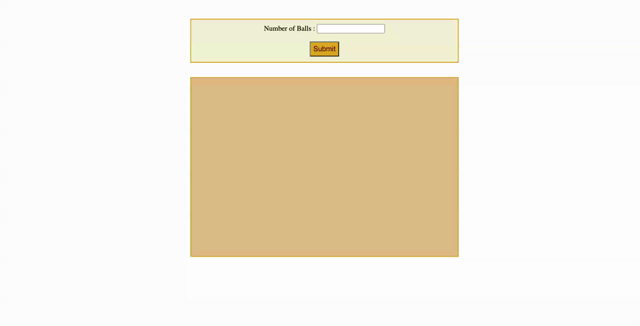

# randomballmove
  It moves the given number of randomly colored balls within the targetted area.

**What I Learned**
- How to access CSS style properties in JS
- Accessing values from HTML form elements
- Create an array of objects and use it in functions
- How to use setTimeout() in a recursive way for continuous ball movement

## Description
- It creates the number of balls given.
- Balls are created in random color in random positions.
- Balls started to move within the given area with specific velocity in x and y direction.
- Once it encounters any edge of the given area it changes its direction and started to move again within the area.
- It goes on forever.

## Installation
git clone https://github.com/vanisbala/randomballmove

## Built with
- [HTML](https://developer.mozilla.org/en-US/docs/Web/HTML)
- [CSS](https://developer.mozilla.org/en-US/docs/Web/CSS)
- [JavaScript](https://developer.mozilla.org/en-US/docs/Web/Javascript)

## Deployed Link
- [See live Site](https://vanisbala.github.io/randomballmove/)

## randomballmove demo

## Author
### Vani 
- [Link to Github](https://github.com/vanisbala)

## Credits
Thanks to MITxPRO for giving me the opportunity to work on this fun project.

**Tutorials**
- https://attacomsian.com/blog/javascript-get-css-styles

