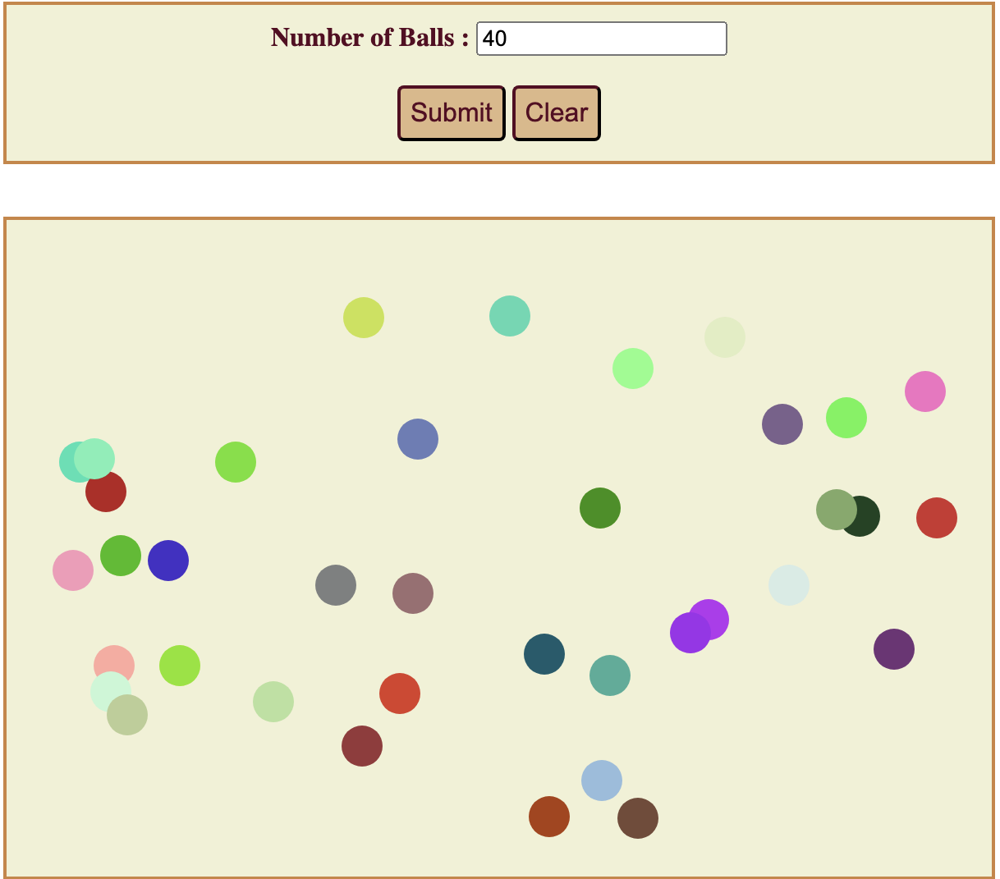

# randomballmove
  It moves the given number of randomly colored balls within the targetted area.

**What I Learned**
- How to access CSS style properties in JS
- Accessing values from HTML form elements
- Create an array of objects and use it in functions
- How to use setTimeout() in a recursive way for continuous ball movement

**ball-move**

## Description
- It creates the number of balls given.
- Balls are created in random color in random positions.
- Balls started to move within the given area with specific velocity in x and y direction.
- Once it encounters any edge of the given area it changes its direction and started to move again within the area.
- It goes on forever.

## Installation
- Download this project in your working directory through, \
git clone https://github.com/vanisbala/randomballmove
- Open randomballmove project in VScode, go to index.html, right click and select 'open in default browser'.
- The project output will open in your browser.
- Enter the number of balls you want to create and submit.
- All the balls start to move within the given window by detecting the edges in all directions.
- You can clear the balls by pressing on Clear button.

<!--**Demo**
-->

## Built with
- [HTML](https://developer.mozilla.org/en-US/docs/Web/HTML)
- [CSS](https://developer.mozilla.org/en-US/docs/Web/CSS)
- [JavaScript](https://developer.mozilla.org/en-US/docs/Web/Javascript)

## Deployed Link
- [See live Site](https://vanisbala.github.io/randomballmove/)

## Author
### Vani 
- [Link to Github](https://github.com/vanisbala)

## Credits
Thanks to MITxPRO for giving me the opportunity to work on this fun project.

**Tutorials**
- https://attacomsian.com/blog/javascript-get-css-styles

